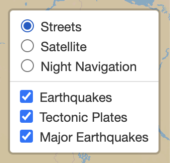
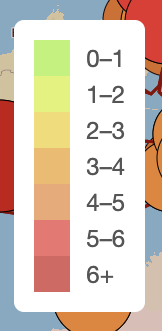
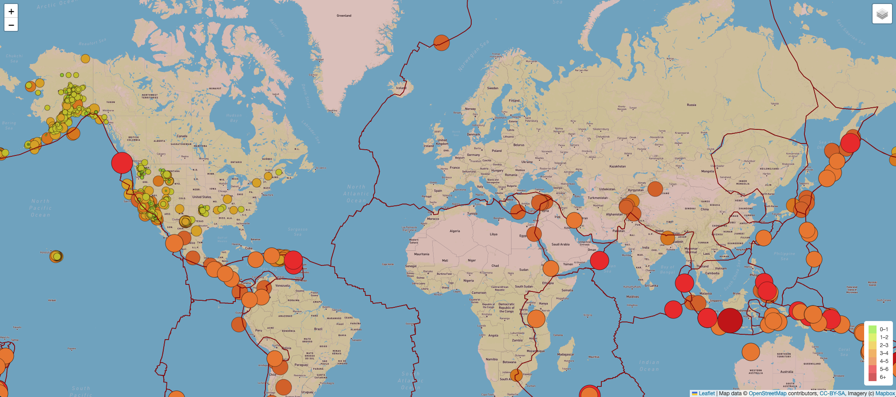
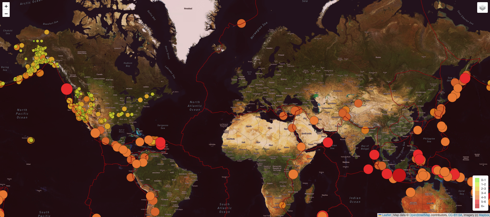
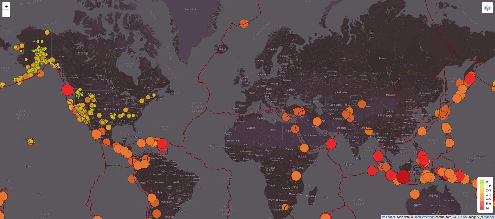

# Mapping_Earthquakes

## Overview
Using geographical data about recent earthquakes this map was created with some features that can be toggled on and off. It provides for three different background viewing options as well as data layers for all earthquakes, major earthquakes, and tectonic plates.  

### Resources

- Software:
    - Visual Studio Code (Version: 1.76.2)
    - Google Chrome 
    
- Languages: JavaScript, CSS, HTML

- Data  API’s:
    - https://earthquake.usgs.gov/earthquakes/feed/v1.0/summary/all_week.geojson
    - https://earthquake.usgs.gov/earthquakes/feed/v1.0/summary/4.5_week.geojson
    - https://raw.githubusercontent.com/fraxen/tectonicplates/master/GeoJSON/PB2002_plates.json
    
- Starter Code: 
    - [earthquake_challenge/starter_code/tectonic_plate_starter_logic.js]( earthquake_challenge/starter_code/tectonic_plate_starter_logic.js)
    - [earthquake_challenge/starter_code/major_eq_starter_logic.js]( earthquake_challenge/starter_code/major_eq_starter_logic.js)
    

### Code: 
- HTML: [earthquake_challenge/index.html](earthquake_challenge/index.html)
- CSS: [earthquake_challenge/static/css/style.css](earthquake_challenge/static/css/style.css)
- JavaScript:  [earthquake_challenge/static/js/challenge_logic.js](earthquake_challenge/static/js/challenge_logic.js)

### Images 

#### Layer Menu

#### Legend

#### Street Map

#### Satellite Map 

#### Night Navigation Map

